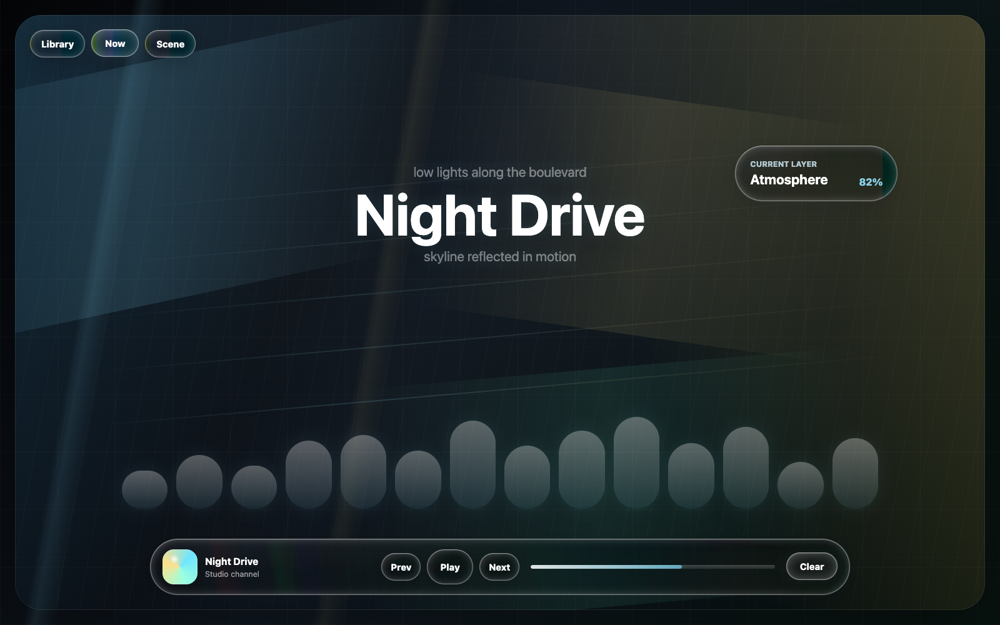
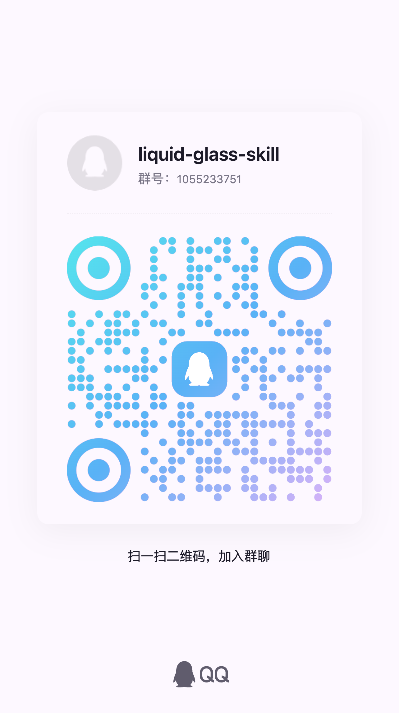

# Liquid Glass Design Skill

An AI-agent skill and template kit for building high-end Liquid Glass interfaces with CSS, SVG refraction filters, JavaScript, and React. Works out of the box with Codex, Claude Code, and any agent that reads `SKILL.md`-style skills.

The refraction core uses inverse lens mapping: a canvas-generated displacement map whose interior is identity and whose edges magnify the backdrop, driven through a per-surface SVG `feDisplacementMap` at a measured — never guessed — scale.



## Join The QQ Group

Scan the QR code to join the `liquid-glass-skill` group chat.



## What Is Included

- `liquid-glass-design/SKILL.md` - the skill entrypoint (workflow, rules, defaults, acceptance criteria).
- `liquid-glass-design/references/` - design principles, the golden-glass quality bar, web implementation contracts, GitHub research, and QA checklists.
- `liquid-glass-design/scripts/generate-displacement-map.mjs` - a zero-dependency PNG displacement map generator that prints the exact `feDisplacementMap` scale.
- `liquid-glass-design/assets/templates/vanilla-liquid-glass/` - a no-build HTML/CSS/JS demo with per-surface filters, lens profiles, pointer glare, and lens maps.
- `liquid-glass-design/assets/templates/react-liquid-glass/` - a React/Vite `<LiquidGlass>` component template with profile/tuning props.

## Install The Skill

Clone the repository:

```bash
git clone https://github.com/<your-name>/liquid-glass-design-skill.git
cd liquid-glass-design-skill
```

### Codex

```bash
mkdir -p ~/.codex/skills
ln -sf "$(pwd)/liquid-glass-design" ~/.codex/skills/liquid-glass-design
```

Then ask Codex:

```text
Use $liquid-glass-design to redesign this toolbar as a Liquid Glass control layer.
```

### Claude Code

```bash
mkdir -p ~/.claude/skills
ln -sf "$(pwd)/liquid-glass-design" ~/.claude/skills/liquid-glass-design
```

Then ask Claude Code to build or review Liquid Glass UI — the skill triggers on Liquid Glass / glassmorphism / refraction requests, or invoke it explicitly with `/liquid-glass-design`.

### Other agents

Any agent that supports Markdown skills can consume `liquid-glass-design/SKILL.md` directly; the references and templates are plain files with no toolchain requirements.

## Try The Vanilla Demo

No build step:

```bash
cd liquid-glass-design/assets/templates/vanilla-liquid-glass
python3 -m http.server 4173
```

Open `http://127.0.0.1:4173`.

Chromium-based browsers (Chrome, Edge, Electron) get true SVG refraction. Safari and Firefox get a graceful frosted-glass fallback automatically.

## Try The React Demo

```bash
cd liquid-glass-design/assets/templates/react-liquid-glass
npm install   # or pnpm install
npm run dev
```

The component API:

```jsx
<LiquidGlass
  radius={26}
  profile="standard"    // standard | soft | prominent | thin
  strength={100}        // % of the measured lens scale
  magnify={1}           // lens curvature 0.2-2
  bend={0.06}
  spread={0.58}
  bezelRatio={0.62}
  dispersion={0.07}     // rim RGB separation; 0 = single pass
  blur={0.2}            // px on the refractive path
  glare={0.56}
  elasticity={0.12}
  tint="rgba(20, 25, 32, .32)"
  interactive
>
  Controls
</LiquidGlass>
```

## Generate A Displacement Map

```bash
node liquid-glass-design/scripts/generate-displacement-map.mjs \
  --width 760 \
  --height 96 \
  --radius 48 \
  --profile prominent
```

The command outputs a PNG data URI (or `--mode png --output map.png`) and prints the measured `feDisplacementMap` scale on stderr. Apply that scale verbatim — the map and the scale are a matched pair.

Options: `--width`, `--height`, `--radius`, `--profile`, `--magnify`, `--bend`, `--spread`, `--bezel-ratio`, `--mode data-uri|png`, `--output`.

## Design Rules

- Use glass on controls and navigation, not as a blanket content layer.
- One filter and one map per distinct surface shape.
- Inverse lens mapping: identity center, edge magnification, measured scale, shape-specific profile.
- Keep blur near zero on the refractive path; punch comes from `contrast`.
- Chromatic dispersion only at the rim, via per-channel scale differences.
- Use pointer-aware glare and tiny elastic drift for interactive controls; never regenerate maps on pointer movement.
- Keep hover and press states stable; do not resize layout on interaction.
- Provide reduced motion, increased contrast, and reduced transparency fallbacks.

## Validate

```bash
node --check liquid-glass-design/scripts/generate-displacement-map.mjs
node --check liquid-glass-design/assets/templates/vanilla-liquid-glass/liquid-glass.js
node --check liquid-glass-design/assets/templates/react-liquid-glass/src/displacementMap.js
```

For the React template:

```bash
cd liquid-glass-design/assets/templates/react-liquid-glass
npm install
npm run build
```

## Browser Support

| Engine | Path |
| --- | --- |
| Chromium / Electron | Full SVG refraction (`backdrop-filter: url(...)`) |
| Safari | Frosted fallback (`blur + saturate + contrast`) |
| Firefox | Frosted fallback |
| Reduced transparency | Near-solid fill, no backdrop-filter |

## Research References

- Apple Newsroom: https://www.apple.com/newsroom/2025/06/apple-introduces-a-delightful-and-elegant-new-software-design/
- WWDC Meet Liquid Glass: https://developer.apple.com/videos/play/wwdc2025/219/
- `rdev/liquid-glass-react`: https://github.com/rdev/liquid-glass-react
- `archisvaze/liquid-glass`: https://github.com/archisvaze/liquid-glass
- `nikdelvin/liquid-glass`: https://github.com/nikdelvin/liquid-glass
- `PallavAg/liquid-glass-web-react`: https://github.com/PallavAg/liquid-glass-web-react
- `iyinchao/liquid-glass-studio`: https://github.com/iyinchao/liquid-glass-studio
- `Z1Code/glass-refraction`: https://github.com/Z1Code/glass-refraction

## License

MIT
