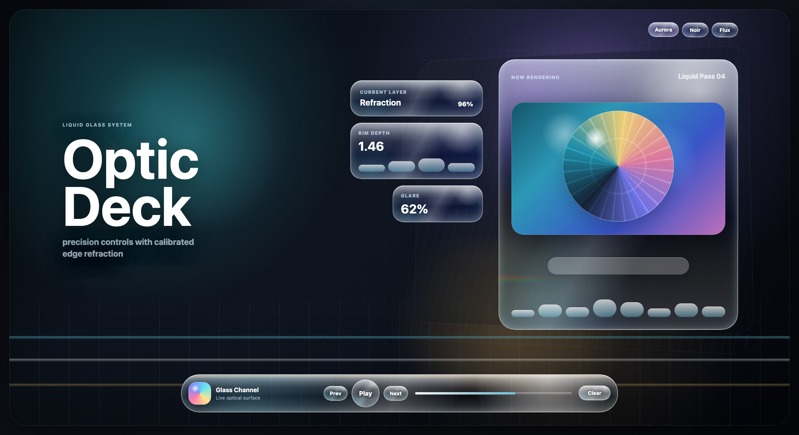
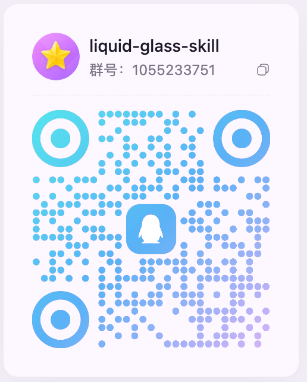

# Liquid Glass Design Skill

一套面向 AI Agent 的 Liquid Glass 设计与实现 Skill，用于生成、升级和审查高品质液态玻璃界面。它包含 CSS/SVG 折射、Canvas displacement map、React 组件模板、视觉 QA、打包脚本和可执行 smoke eval。



## 加入 QQ 群

扫码加入 `liquid-glass-skill` 群聊。



## 安装

克隆仓库：

```bash
git clone https://github.com/xinlingfeiwu/liquid-glass-design-skill.git
cd liquid-glass-design-skill
```

### Codex

```bash
mkdir -p ~/.codex/skills
ln -sf "$(pwd)/liquid-glass-design" ~/.codex/skills/liquid-glass-design
```

推荐提示词：

```text
Use $liquid-glass-design to upgrade this existing UI into premium Liquid Glass without replacing the product context. Fix hierarchy, overlap, clipped rims, and dock/toolbar centering before tuning glass. Verify with screenshots plus browser geometry checks.
```

### Cowork / `.skill` 上传

可以直接下载最新 Release 资产：

- Full 包：[liquid-glass-design.skill](https://github.com/xinlingfeiwu/liquid-glass-design-skill/releases/latest/download/liquid-glass-design.skill)
- Lean 包：[liquid-glass-design.lean.skill](https://github.com/xinlingfeiwu/liquid-glass-design-skill/releases/latest/download/liquid-glass-design.lean.skill)

也可以本地打包：

```bash
node liquid-glass-design/scripts/package-skill.mjs
node liquid-glass-design/scripts/package-skill.mjs --lean
```

然后在 Cowork 设置中上传 `dist/liquid-glass-design.skill` 或 `dist/liquid-glass-design.lean.skill`。Full 包保留 eval/dev 资源；Lean 包会剔除 `evals/`、`agents/openai.yaml`、研究记录、模板 lockfile 和 eval-only 脚本。

### Claude Code / Plugin

可以使用 symlink 安装，也可以使用上面的 `.skill` 包走 Claude Code plugin/marketplace 兼容流程。`liquid-glass-design/LICENSE` 会随 skill 文件夹一起分发。

## 使用方式

- 新建高品质界面：先选 `design-recipes.md` 中的构图配方，再按 `golden-glass-style.md` 选择 production 或 showcase 默认值。
- 升级现有产品：先修层级、重叠、裁切、Dock 居中，再调折射、边缘光、色差和 glare。
- 做 React 组件：使用 `assets/templates/react-liquid-glass/`，保持 props、类型声明和 SSR fallback。
- 做跨框架组件：使用 `assets/templates/web-component-liquid-glass/`，直接提供可移植的 `<liquid-glass>` custom element。
- 做 Electron 集成：读取 `references/electron.md`，先处理窗口、拖拽区、renderer 缓存和平台 fallback。
- 做视觉验收：使用 `check-visual-geometry.mjs` 检查重叠、居中、viewport containment、fallback、contrast 和 committed baseline 像素回归。

## 运行 Demo

Vanilla：

```bash
npm run dev:vanilla
```

打开 `http://127.0.0.1:4173/templates/vanilla-liquid-glass/`。

React：

```bash
cd liquid-glass-design/assets/templates/react-liquid-glass
npm install
npm run dev
```

Web Component：

```bash
npm run dev:web-component
```

打开 `http://127.0.0.1:4174/templates/web-component-liquid-glass/`。

任意 HTML/框架里可直接使用：

```html
<script type="module" src="./liquid-glass-element.js"></script>

<liquid-glass radius="34" profile="prominent" strength="142" dispersion="0.035" interactive>
  Controls
</liquid-glass>
```

## 视觉 QA

```bash
npm i -D playwright && npx playwright install chromium
node liquid-glass-design/scripts/check-visual-geometry.mjs \
  --url http://127.0.0.1:4173/templates/vanilla-liquid-glass/ \
  --screenshot-dir ./shots \
  --contrast \
  --min-contrast 4.5
```

像素回归默认对比仓库内提交的 baseline：

```bash
node liquid-glass-design/scripts/check-visual-geometry.mjs \
  --url http://127.0.0.1:4173/templates/vanilla-liquid-glass/ \
  --baseline-dir liquid-glass-design/evals/baselines \
  --pixel-threshold 0.10 \
  --pixel-channel-threshold 24 \
  --roi-roles dock,focus \
  --roi-pixel-threshold 0.08
```

只有视觉变化是有意的，才更新 baseline：

```bash
npm run qa:vanilla:update-baseline
git diff -- liquid-glass-design/evals/baselines
```

验证 fallback：

```bash
npm run qa:vanilla:fallback
npm run qa:vanilla:webkit-detect
npm run qa:vanilla:reduced-motion
```

仓库里的 baseline PNG 只用于 CI 视觉回归，不会进入 full/lean `.skill` 分发包。

## 校验

```bash
npm test
```

React 模板：

```bash
cd liquid-glass-design/assets/templates/react-liquid-glass
npm ci
npm run build
```

## 关键原则

- `golden-glass-style.md` 是唯一默认参数来源。
- Production 和 Showcase 两档要先选清楚。
- 先做构图，再调玻璃。
- 只在控制层、导航层、浮层使用玻璃，不把内容层整屏玻璃化。
- 使用测量过的 `feDisplacementMap` scale，不猜参数。
- 禁止 `background-attachment: fixed` 背景克隆，禁止 `feOffset` 整通道色偏。
- 交付前必须有截图或可测量 QA 结果。

## License

MIT
